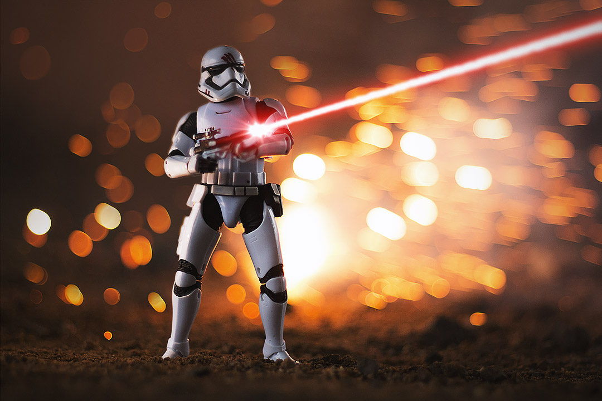
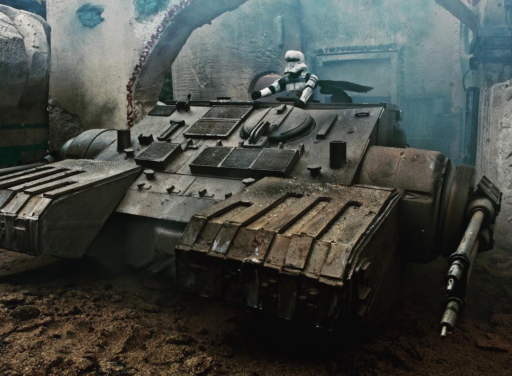
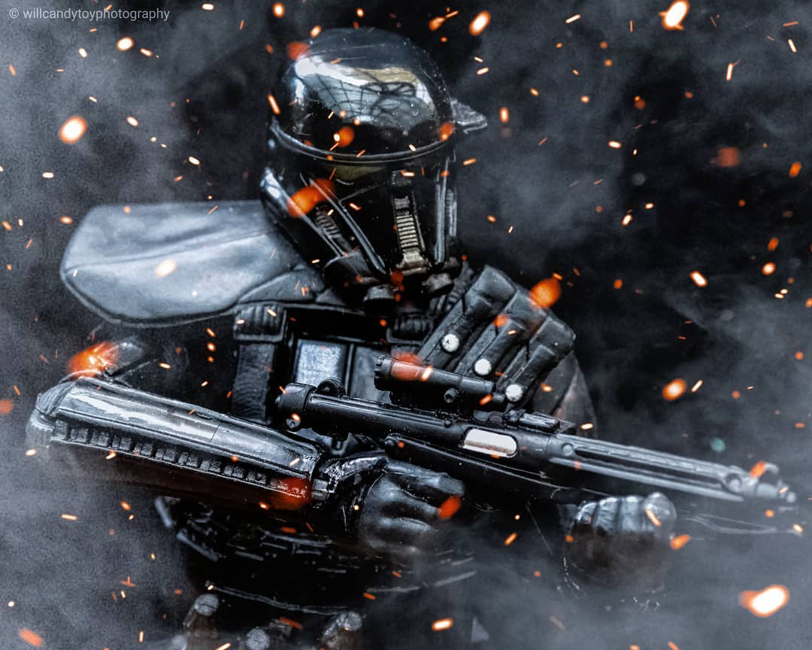
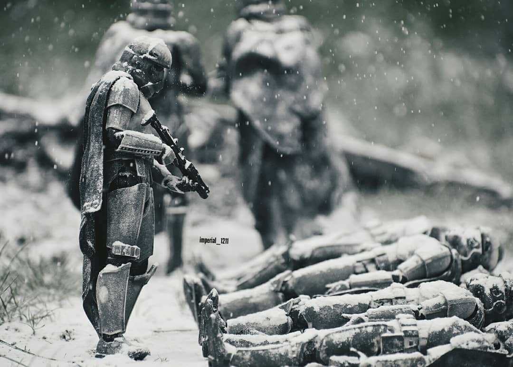

# Star Wars Toy Photography

by [Charles Iliya Krempeaux](http://changelog.ca)

This article covers how to get started with **Star Wars toy photography**.

## Table of Contents

* [Photographs And Photographers](#photographs-and-photographers)
  * [Examples](#examples)
  * [Who To Follow on Instagram](#who-to-follow-on-instagram)
  * [Hashtags on Instagram](#hashtags-on-instagram)
  * [Realistic Toy Photography](#realistic-toy-photography)
  * [Movie Special Effects](#movie-special-effects)

## Photographs And Photographers

### Examples

There is a saying: _a picture is worth a thousand words_.

So maybe the best way to start talking about **Star Wars toy photography** is to just show some examples of _Star Wars toy photography_:…

by [the_chip_monsters](https://www.instagram.com/the_chip_monsters/)
( [source](https://instagram.com/p/BsejriAF4eT/) )

by [chewbacookie](https://www.instagram.com/chewbacookie/)
( [source](https://www.instagram.com/p/BsJjKqEnYWx/) )

by [geek.turtle](https://www.instagram.com/geek.turtle/)
( [source](https://www.instagram.com/p/BpCki6_H7lj/) )

by [willcandytoyphotography](https://www.instagram.com/willcandytoyphotography/)
( [source](https://www.instagram.com/p/BsuOrHgFolc/) )

by [@imperial_1211](https://www.instagram.com/imperial_1211/)
( [source](https://www.instagram.com/p/BsoFChHHvv7/) )

### Who To Follow on Instagram

If you are looking to find more **Star Wars toy photography** photos, then head over to Instagram and follow these people:…

* [@blksrs](https://www.instagram.com/blksrs/)
* [@chewbacookie](https://www.instagram.com/chewbacookie/)
* [@chezpics66](https://www.instagram.com/chezpics66/)
* [@geek.turtle](https://www.instagram.com/geek.turtle/)
* [@imperial_1211](https://www.instagram.com/imperial_1211/)
* [@latentimperium](https://www.instagram.com/latentimperium/)
* [@starwarstheblackseries](https://www.instagram.com/starwarstheblackseries/)
* [@stormtrooper_robbie](https://www.instagram.com/stormtrooper_robbie/)
* [@the_chip_monsters](https://www.instagram.com/the_chip_monsters/)
* [@trooperalliance](https://www.instagram.com/trooperalliance/)
* [@tx0666](https://www.instagram.com/tx0666/)
* [@willcandytoyphotography](https://www.instagram.com/willcandytoyphotography/)

This list is in alphabetical order. So no importance should be attributed to the order I put them into.

Also, there are many other Instagram accounts out there for **Star Wars toy photography**.

This list is not meant to be the exhaustive.
**This list of is just meant to get you started with _Star Wars toy photographers_ to follow.**

There are certainly many other **Star Wars toy photographers** to follow too.

### Hashtags on Instagram

Many **Star Wars toy photographers** on Instagram tend to tag their **Star Wars toy photography** photos with certain hashtags.

If you were to browse those hashtags you would see _a lot_ of **Star Wars toy photography** photos.

And Instagram even lets you _follow_ hashtags.

But anyway, these are some **Star Wars toy photography** related hashtags on Instagram:

* [#BandaiStarWars](https://www.instagram.com/explore/tags/bandaistarwars/)
* [#HasbroStarWars](https://www.instagram.com/explore/tags/hasbrostarwars/)
* [#HotToysStarWars](https://www.instagram.com/explore/tags/hottoysstarwars/)
* [#MafexStarWars](https://www.instagram.com/explore/tags/mafexstarwars/)
* [#SHFiguartsStarWars](https://www.instagram.com/explore/tags/shfiguartsstarwars/)
* [#SideshowStarWars](https://www.instagram.com/explore/tags/sideshowstarwars/)
* [#StarWarsActionFigures](https://www.instagram.com/explore/tags/starwarsactionfigures/)
* [#StarWarsBlackSeries](https://www.instagram.com/explore/tags/starwarsblackseries/)
* [#StarWarsBlackSeries6Inch](https://www.instagram.com/explore/tags/starwarsblackseries6inch/)
* [#StarWarsFigures](https://www.instagram.com/explore/tags/starwarsfigures/)
* [#StarWarsTheBlackSeries](https://www.instagram.com/explore/tags/starwarstheblackseries/)
* [#StarWarsPhotography](https://www.instagram.com/explore/tags/starwarsphotography/)
* [#StarWarsToyPix](https://www.instagram.com/explore/tags/starwarstoypix/)
* [#StarWarsToys](https://www.instagram.com/explore/tags/starwarstoys/)
* [#TBSFF](https://www.instagram.com/explore/tags/tbsff/)
* [#TheBlackSeries](https://www.instagram.com/explore/tags/theblackseries/)

### Realistic Toy Photography

**Star Wars toy photography** comes in different forms.

One of those forms is the _realistic toy photography_ form.

I.e., where when you look at the photograph, you cannot immediately tell whether it is a photo of real person or people in Star Wars costumes (either in a Star Wars film, or in cosplay), or a photo of toys.

Examples of _realistic Star Wars toy photography_ was shown in the [Examples](#examples) section.

(Another form of **Star Wars toy photography** is where the photographer wants the Star Wars action figure to look like a small toy in the photo.)

**This article is going to focus on _realistic Star Wars toy photography_.**

### Movie Special Effects

The _realistic Star Wars toy photography_ form has similarities to the _miniature models_ used for creating certain _special effects_ in the original 3 Star Wars movies.

Before computers became ubiquitous, _miniature models_ were often used for creating certain kinds of _special effects_ in movies.

Like many other movies of past eras, the original 3 Star Wars movies made extensive use of _miniature models_.

**In a lot of ways, **Star Wars toy photography** follows the tradition of the original 3 Star Wars movies' use of _miniature models_ for creating certain _special effects_.**

Star Wars action figures are a type of _miniature model_ after all.

