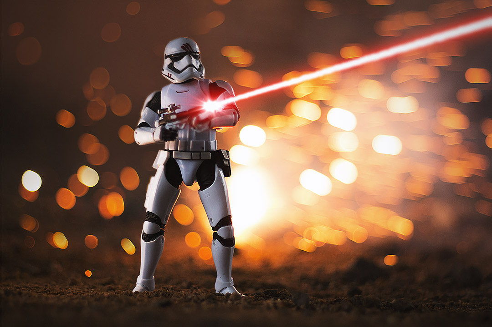
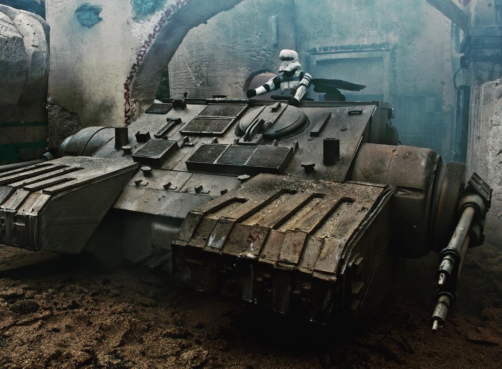

# Star Wars Toy Photography

by [Charles Iliya Krempeaux](http://changelog.ca)

This article covers how to get started with **Star Wars toy photography**.

## Examples

There is a saying: _a picture is worth a thousand words_.

So maybe the best way to start talking about **Star Wars toy photography** is to just show some examples of _Star Wars toy photography_:…

by [the_chip_monsters](https://www.instagram.com/the_chip_monsters/)
( [source](https://instagram.com/p/BsejriAF4eT/) )

by [chewbacookie](https://www.instagram.com/chewbacookie/)
( [source](https://www.instagram.com/p/BsJjKqEnYWx/) )

by [geek.turtle](https://www.instagram.com/geek.turtle/)
( [source](https://www.instagram.com/p/BpCki6_H7lj/) )

by [willcandytoyphotography](https://www.instagram.com/willcandytoyphotography/)
( [source](https://www.instagram.com/p/BsuOrHgFolc/) )

## Who To Follow on Instagram

If you are looking to find more **Star Wars toy photography** photos, then head over to Instagram and follow these people:…

* [@blksrs](https://www.instagram.com/blksrs/)
* [@chewbacookie](https://www.instagram.com/chewbacookie/)
* [@chezpics66](https://www.instagram.com/chezpics66/)
* [@geek.turtle](https://www.instagram.com/geek.turtle/)
* [@latentimperium](https://www.instagram.com/latentimperium/)
* [@starwarstheblackseries](https://www.instagram.com/starwarstheblackseries/)
* [@stormtrooper_robbie](https://www.instagram.com/stormtrooper_robbie/)
* [@the_chip_monsters](https://www.instagram.com/the_chip_monsters/)
* [@trooperalliance](https://www.instagram.com/trooperalliance/)
* [@tx0666](https://www.instagram.com/tx0666/)
* [@willcandytoyphotography](https://www.instagram.com/willcandytoyphotography/)

This list is in alphabetical order. So no importance should be attributed to the order I put them into.

Also, there are many other Instagram accounts out there for **Star Wars toy photography**.

This list is not meant to be the exhaustive.
It is just meant to get you started with **Star Wars toy photographers** follow.
