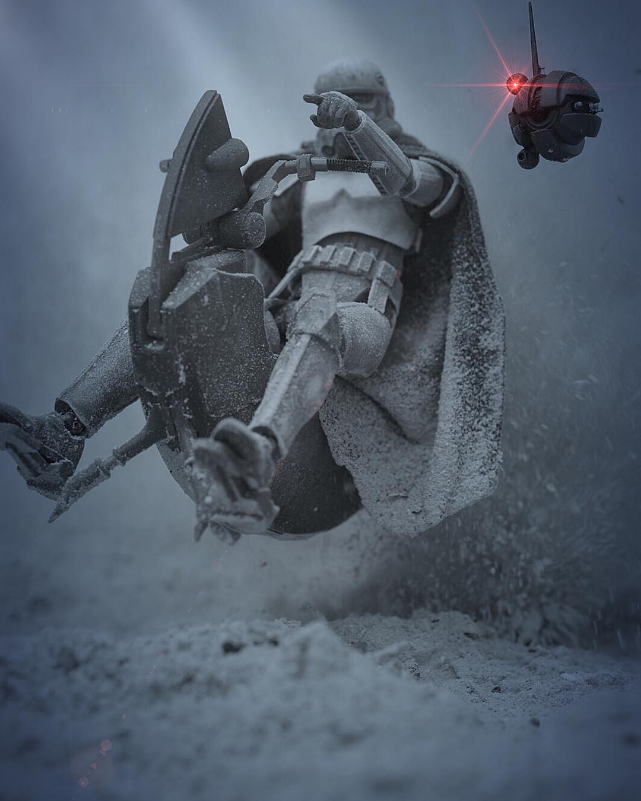

# Star Wars Toy Photography

by [Charles Iliya Krempeaux](http://changelog.ca)

This article covers how to get started with **Star Wars toy photography**.
Including both:…

* where to find **Star Wars toy photography** photos, and
* how to become a **Star Wars toy photographer**, and create your own **Star Wars toy photography** photos.

**Star Wars toy photography** (which is a bit of a misnormer) uses **Star Wars action figures**, their vehicles, and scale models as **miniature models** to create _realistic scenes_,
where it often looks like the characters in the photo are real people in Star Wars costumes (rather than _Star Wars action figures_),
and the scene looks like it could be from a _Star Wars movie_, or _cosplay enactment_.

This is a lot like how many forms of cinematic _special effects_ were done in the original 3 Star Wars movies (back before computers became ubiquitous, and computer-generated _special effects_ became common in the movie industry).

## Table of Contents

* [Photographs And Photographers](#photographs-and-photographers)
  * [Examples](#examples)
  * [Who To Follow on Instagram](#who-to-follow-on-instagram)
  * [Hashtags on Instagram](#hashtags-on-instagram)
* [Style](#style)
  * [Realistic Toy Photography](#realistic-toy-photography)
  * [Movie Special Effects](#movie-special-effects)
* [Action Figures](#action-figures)
  * [Action Figure Recommendations](#action-figure-recommendations)
    * [My First Action Figure](#my-first-action-figure)
    * [Team Of Three](#team-of-three)
  * [Action Figure Scales](#action-figure-scales)
    * [1/6 Scale (12 Inch Scale)](#16-scale-12-inch-scale)
    * [10 Inch Scale](#10-inch-scale)
    * [1/12 Scale (6 Inch Scale)](#112-scale-6-inch-scale)
  * [Custom Action Figures](#custom-action-figures)
* [First Photographs](#first-photographs)
* [Posing](#posing)
  * [Posing With Wires](#posing-with-wires)
* [Lightbox](#lightbox)
* [Droids](#droids)
* [Animals](#animals)
  * [Bantha](#bantha)
  * [Dewback](#dewback)
* [Dioramas](#dioramas)
  * [Snow](#snow)
* [Customizing](#customizing)
  * [Metal Plating](#metal-plating)
    * [Electro Plating Plastic](#electro-plating-plastic)
    * [Molotow Liquid Chrome](#molotow-liquid-chrome)
* [Weapons](#weapons)
  * [Blasters](#blasters)
    * [Custom Blasters](#custom-blasters)
      * [Purchasing Custom Blasters](#purchasing-custom-blasters)
      * [Making Custom Blasters](#making-custom-blasters)
  * [Lightsabers](#lightsabers)
    * [Custom Lightsabers](#custom-lightsabers)
      * [Purchasing Custom Lightsabers](#purchasing-custom-lightsabers)
      * [Making Custom Lightsabers](#making-custom-lightsabers)

## Photographs And Photographers

### Examples

There is a saying: _a picture is worth a thousand words_.

So maybe the best way to start talking about **Star Wars toy photography** is to just show some examples of _Star Wars toy photography_:…

by [@the_chip_monsters](https://www.instagram.com/the_chip_monsters/)
( [source](https://instagram.com/p/BsejriAF4eT/) )

by [@chewbacookie](https://www.instagram.com/chewbacookie/)
( [source](https://www.instagram.com/p/BsJjKqEnYWx/) )

by [@geek.turtle](https://www.instagram.com/geek.turtle/)
( [source](https://www.instagram.com/p/BpCki6_H7lj/) )

by [@willcandytoyphotography](https://www.instagram.com/willcandytoyphotography/)
( [source](https://www.instagram.com/p/BsuOrHgFolc/) )

by [@imperial_1211](https://www.instagram.com/imperial_1211/)
( [source](https://www.instagram.com/p/BsoFChHHvv7/) )

I think the name **“toy photography”** (in _Star Wars toy photography_) confuses some people.

I think the name **“toy photography”** gives people (who have never seen _Star Wars toy photography_ before) the expectation that the _Star Wars action figures_ will look like kids' toys.

I don't think they expect _Star Wars toy photography_ to use _Star Wars action figures_ as a _miniature models_ in the same way Hollywood style [movie special effects](#movie-special-effects) used _miniature models_ to create realistic scenes, where it wasn't obvious to the viewer that _miniature models_ were used (instead of real people).

### Who To Follow on Instagram

If you are looking to find more **Star Wars toy photography** photos, then head over to Instagram and follow these people:…

* [@3lesie](https://www.instagram.com/3lesie/)
* [@blksrs](https://www.instagram.com/blksrs/)
* [@chewbacookie](https://www.instagram.com/chewbacookie/)
* [@chezpics66](https://www.instagram.com/chezpics66/)
* [@geek.turtle](https://www.instagram.com/geek.turtle/)
* [@ilmanakbar.sw](https://www.instagram.com/ilmanakbar.sw/)
* [@imperial_1211](https://www.instagram.com/imperial_1211/)
* [@latentimperium](https://www.instagram.com/latentimperium/)
* [@passage2alderaan](https://www.instagram.com/passage2alderaan/)
* [@rogue_studios](https://www.instagram.com/rogue_studios/)
* [@starwarstheblackseries](https://www.instagram.com/starwarstheblackseries/)
* [@stormtrooper_robbie](https://www.instagram.com/stormtrooper_robbie/)
* [@the_chip_monsters](https://www.instagram.com/the_chip_monsters/)
* [@the_imperial_grunt](https://www.instagram.com/the_imperial_grunt/)
* [@trooperalliance](https://www.instagram.com/trooperalliance/)
* [@tx0666](https://www.instagram.com/tx0666/)
* [@willcandytoyphotography](https://www.instagram.com/willcandytoyphotography/)

This list is in alphabetical order. So no importance should be attributed to the order I put them into.

Also, there are many other Instagram accounts out there for **Star Wars toy photography**.

This list is not meant to be the exhaustive.
**This list of is just meant to get you started with _Star Wars toy photographers_ to follow.**

There are certainly many other **Star Wars toy photographers** to follow too.

### Hashtags on Instagram

Many **Star Wars toy photographers** on Instagram tend to tag their **Star Wars toy photography** photos with certain hashtags.

If you were to browse those hashtags you would see _a lot_ of **Star Wars toy photography** photos.

And Instagram even lets you _follow_ hashtags.

But anyway, these are some **Star Wars toy photography** related hashtags on Instagram:

* [#BandaiStarWars](https://www.instagram.com/explore/tags/bandaistarwars/)
* [#HasbroStarWars](https://www.instagram.com/explore/tags/hasbrostarwars/)
* [#HotToysStarWars](https://www.instagram.com/explore/tags/hottoysstarwars/)
* [#MafexStarWars](https://www.instagram.com/explore/tags/mafexstarwars/)
* [#SHFiguartsStarWars](https://www.instagram.com/explore/tags/shfiguartsstarwars/)
* [#SideshowStarWars](https://www.instagram.com/explore/tags/sideshowstarwars/)
* [#StarWarsActionFigures](https://www.instagram.com/explore/tags/starwarsactionfigures/)
* [#StarWarsBlackSeries](https://www.instagram.com/explore/tags/starwarsblackseries/)
* [#StarWarsBlackSeries6Inch](https://www.instagram.com/explore/tags/starwarsblackseries6inch/)
* [#StarWarsFigures](https://www.instagram.com/explore/tags/starwarsfigures/)
* [#StarWarsTheBlackSeries](https://www.instagram.com/explore/tags/starwarstheblackseries/)
* [#StarWarsPhotography](https://www.instagram.com/explore/tags/starwarsphotography/)
* [#StarWarsToyPix](https://www.instagram.com/explore/tags/starwarstoypix/)
* [#StarWarsToys](https://www.instagram.com/explore/tags/starwarstoys/)
* [#TBSFF](https://www.instagram.com/explore/tags/tbsff/)
* [#TheBlackSeries](https://www.instagram.com/explore/tags/theblackseries/)

## Style

**Star Wars toy photography** comes in different forms.

One of those forms is the _realistic toy photography_ form.

### Realistic Toy Photography

For _Star Wars toy photography_, the _realistic toy photography_ form is where when you look at the photograph, you cannot immediately tell whether it is a photo of real person or people in Star Wars costumes (either in a Star Wars film, or in cosplay), or a photo of _action figures_, their _vehicles_, or scale models.

Examples of _realistic Star Wars toy photography_ were shown in the [Examples](#examples) section. And there are more examples throughout the rest of this document.

(Another form of **Star Wars toy photography** is where the photographer wants the Star Wars action figure to look like a small toy in the photo.)

**This article is going to focus on _realistic Star Wars toy photography_.**

### Movie Special Effects

The _realistic Star Wars toy photography_ form has similarities to the **miniature models** used for creating certain **special effects** in the original 3 Star Wars movies.

Before computers became ubiquitous, _miniature models_ were often used for creating certain kinds of _special effects_ in movies. For example:…

( [source](https://www.inverse.com/article/22234-special-effects-in-godzilla-movies-history) )

( [source](http://nzpetesmatteshot.blogspot.com/2010/09/big-boys-toys-howard-and-theodore.html) )

Like many other movies of past eras, the original 3 Star Wars movies made extensive use of _miniature models_. For example:…

( [source](https://www.starwars.com/news/the-5-most-grueling-star-wars-visual-effects) )

( [source](https://propstoreauction.com/view-auctions/catalog/id/78/lot/18558/) )

**In a lot of ways, _Star Wars toy photography_ follows the tradition of the original 3 Star Wars movies' use of _miniature models_ for creating certain _special effects_.**

Star Wars action figures and their vehicles are a type of _miniature model_ after all.

## Action Figures

After seeing and reading all of that, you may be interested in becoming a **Star Wars toy photographer** yourself.

If you want to do that, then one thing you should probably do is get yourself some **Star Wars action figures**.

### Action Figure Recommendations

If you have no idea what **Star Wars action figures** to start off getting, and just want a recommendation, then here it is:…

**Tip #1**:

Start off getting one or two **Star Wars action figures** from this list:

* Boba Fett,
* Captain Phasm,
* Captain Rex,
* Clone Trooper,
* Death Trooper,
* First Order Executor,
* First Order Riot Control Storm Trooper,
* First Order Storm Trooper,
* First Order Storm Trooper Heavy Gunner,
* Flame Trooper,
* Hover Tank Commander,
* Jango Fett,
* Mimban Storm Trooper,
* Patrol Trooper,
* Praetorian Guard,
* Range Trooper,
* Sand Trooper,
* Sand Trooper Corporal,
* Sand Trooper Squad Leader,
* Scout Trooper,
* Shadow Scout Trooper,
* Shadow Guard,
* Shadow Trooper,
* Shock Trooper,
* Shore Trooper,
* Snow Trooper,
* Storm Trooper,
* Storm Trooper Officer,
* Storm Trooper with Extra Gear.

**Obviously you do NOT need to buy all of these _Star Wars action figures_ to get started with _Star Wars toy photography_.**

Just pick one or two things from that list, to get started.

Basically start off with **Star Wars action figures** that, _in the movies_, have helmets and body suits that are mostly made up of hard parts.

Why?!… Because that you cannot see the eyes, the skin, and (what should be but often isn't) soft clothes on these action figures makes it is easier to take a _good_ looking photos with these action figures.

And when you are starting off with _Star Wars toy photography_, not adding that complexity is probably a good idea.

(Later on you can try action figures that are outside of this.)

**Tip #2**:

Start with **¹⁄₁₂ scale** of **Star Wars action figures**.

**¹⁄₁₂ scale** are also called **6 inch scale** action figures.

If you want to keep the price as low as possible, then go for the **6 inch scale** version of the **Hasbro Star Wars The Black Series** line of **Star Wars action figures**.

(WARNING: **Hasbro Star Wars The Black Series** comes in 2 different sizes. The larger **6 inch scale**. And the smaller _3.75 inch scale_.
If you are going to use the _Hasbro Star Wars The Black Series_ line for **Star Wars toy photography**, then I would recommend the _6 inch scale_ version (over the _3.75 inch scale_ version)).

(You can also mix the _6 inch scale_ version of the _Hasbro Star Wars The Black Series_ line, with the _S.H.Figuarts Star Wars_ line which is also at the _6 inch scale_.)

If you are OK with paying a bit more, to get a better level of detail, and better posability in your _Star Wars action figures_, then go for **S.H.Figuarts Star Wars** action figures.

The _Hasbro Black Series_ action figures are less expensive than the _S.H.Figuarts_.
But the _S.H.Figuarts_ tend to be more posable, and have better details than the _Hasbro Black Series_ action figures.

(If you are curious, I have _both_ **S.H.Figuarts Star Wars** action figures, and **Hasbro Star Wars The Black Series** action figures.)

#### My First Action Figure

If you are curious, I started off with an S.H.Figuarts _Death Trooper_.

Knowing what I know now I'd say that was probably a good choice for a first Star Wars action figure, as S.H.Figuarts tend to be more _posable_ than the alternatives in the ¹⁄₁₂ scale — in the 6 inch scale;
and often have a higher level of detail than the alternative brands in the ¹⁄₁₂ scale — in the 6 inch scale.

But my collection at the ¹⁄₁₂ scale -- at the 6 inch scale -- is made up of both _S.H.Figuarts Star Wars_ action figures, and _Hasbro Star Wars The Black Series_ action figures.

#### Team Of Three

I have seen a number of _Star Wars toy photography_ photos where the subjects of the photo are 3 troopers of the same type.

Maybe:

* 3 _Sand Troopers_, or
* 3 _Mimban Storm Troopers_, or
* 3 _Death Troopers_, or
* 3 _First Order Storm Troopers_.

One option for your first _Star Wars action figures_, and your first photos, could be to get a _team of three_.

### Action Figure Scales

_Star Wars action figures_ come in different sizes.

We try to be precise about these different sizes by talking about: **scale**.

Some example _scales_ include the **¹⁄₆ scale**, and the **¹⁄₁₂ scale**.
These are also know as the **12 inch scale**, and the **6 inch scale** respectively.

I.e., **¹⁄₆ scale** = **12 inch scale**.

And **¹⁄₁₂ scale** = **6 inch scale**.

Action figures in the **¹⁄₆ scale** (i.e., **12 inch scale**) are bigger.
Tend to have a fantastic level detail.
But are also very expensive for many people.

Action figures in the **¹⁄₁₂ scale** (i.e., **6 inch scale**) are smaller.
Tend to have OK detail (although not the best).
But are a more affordable option for many people.

So, what do we really mean by **scale**.…

#### 1/6 Scale (12 Inch Scale)

One scale is known as the **¹⁄₆ scale**.
Many people also write this as: **1/6 scale**.
Some write this as **1:6 scale**..

This is also sometimes called the **12 inch scale**.
Which is also sometimes written: **12" scale**.

Let's imagine that a real human in a Stormtrooper costume is 6 feet tall.

Then if we were to make an action figure of this 6 foot tall person at _¹⁄₆ scale_ (as companies such as Hot Toys, and Sideshow do), then the action figure would be 12 inches tall.

Why?! Well because: 6 feet × ¹⁄₆ = 1 foot = 12 inches.

(That is where the alternate name “12 inch scale” comes from.)

Let's do another example for the **¹⁄₆ scale**:

An AT-ST is 28 feet tall.

So then at the _¹⁄₆ scale_ the AT-ST would be 56 inches tall.

Why?! Well because: 28 feet × ¹⁄₆ = 336 inches × ¹⁄₆ = 56 inches. (Or 4 foot 8 inches tall.)

Companies that make _Star Wars action figures_ in the **¹⁄₆ scale** include:

* [Hot Toys](http://www.hottoys.com.hk/), and
* [Sideshow](https://www.sideshowtoy.com/).

_Star Wars action figures_ at the **¹⁄₆ scale** tend to be at a very high level of quality.
And have the a fantastic level of detail.

(Keep in mind that the higher the level of detail, the better close-ups photos of the action figure will look.)

But _Star Wars action figures_ in the **¹⁄₆ scale** tend to cost **A LOT** more than, for example, _Star Wars action figures_ in the _¹⁄₁₂ scale_.

A single _Star Wars action figure_ in the **¹⁄₆ scale** can cost hundreds of dollars.

Some people are willing to spend that kind of money to get _Star Wars action figures_ in the **¹⁄₆ scale**.

Some aren't willing (or can't) and stick to less expensive _Star Wars action figures_ at the _¹⁄₁₂ scale_.

(FWIW, I do have some **¹⁄₆ scale** _Star Wars action figures_ from both _Hot Toys_, and _Sideshow_.
But I have A LOT more _Star Wars action figures_ at the _¹⁄₁₂ scale_ _from S.H.Figuarts_, and _Hasbro The Black Series_.)

#### 10 Inch Scale

Another scale is known as the **10 inch scale**.

Note that, **10 inch scale** is also sometimes written: **10" scale**.

Disney has a line of **10 inch scale** action figures, that goes under the product line name of: **Star Wars: Elite Series: Premium Action Figure**.

(Disney has more than one line of _Star Wars action figures_. So if you are searching for the _10 inch scale_ _Star Wars: Elite Series: Premium Action Figure_, be aware of this.)

I haven't seen many people use them for _Star Wars toy photography_. Although I'm not sure why.

Some of these Disney _Star Wars Elite Series Premium Action Figures_ look very photogenic.

And although they aren't as detailed as _Star Wars action figures_ in the _¹⁄₆ scale_ (i.e., the _12 inch scale_) by Hot Toys or Sideshow.
They are more detailed than _Star Wars action figures_ in the _¹⁄₁₂ scale_ (i.e., the _6 inch scale_) by Bandai (model kits, S.H.Figuarts), Medicom (Mafex), and Hasbro (The Black Series).

In addition to this, the are very inexpensive (compared to what you are paying for other lines).

A Disney **Star Wars Elite Series Premium Action Figure** costs about USD $20.

If you are interested in these _Star Wars action figures_ for your _Star Wars toy photography_ I would recommend getting the **Death Trooper**.

In fact, the _Star Wars toy photography_ I have seen with Disney's _10 inch scale_ _Star Wars Elite Series Premium Action Figures_ has been with the **Death Trooper**

If you want to pick up the _Death Trooper_ from this Disney line of _Star Wars action figure_ it comes under a name that is something like: **Star Wars: Elite Series: Imperial Death Trooper: Premium Action Figure**.

Here are some _Star Wars toy photography_ photos of the **10" scale Disney Star Wars Elite Series Imperial Death Trooper Premium Action Figure**:…

by [@the_imperial_grunt](https://www.instagram.com/the_imperial_grunt/)
( [source](https://www.instagram.com/p/Bri6jwoHqyP/) )

by [@the_chip_monsters](https://www.instagram.com/the_chip_monsters/)
( [source](https://www.instagram.com/p/Br4P4AGl3yz/) )

by [@the_chip_monsters](https://www.instagram.com/the_chip_monsters/)
( [source](https://www.instagram.com/p/BrQvBd2l_49/) )

by [@the_chip_monsters](https://www.instagram.com/the_chip_monsters/)
( [source](https://www.instagram.com/p/BrT2C_vgrV6/) )

#### 1/12 Scale (6 Inch Scale)

At least at the time of writting, the **¹⁄₁₂ scale** is much more popular (in terms of usage) for _Star Wars toy photography (than the _¹⁄₆ scale_)._

The **¹⁄₁₂ scale** is also written as: **1/12 scale**.
Some write this as **1:12 scale**..

This is also sometimes called the **6 inch scale**.
Which is also sometimes written: **6" scale**.

Let's go over the same examples as before, to make things clear(er) around the **¹⁄₁₂ scale**.

Again, let's imagine that a real human in a Stormtrooper costume is 6 feet tall.

Then if we were to make an action figure of this 6 foot tall person at _¹⁄₁₂ scale_ (as companies such as S.H.Figuarts, Hasbro, Bandai, and Medicom do), then the action figure would be 6 inches tall.

Why?! Well because: 6 feet × ¹⁄₁₂ = ¹⁄₂ foot = 6 inches.

(That is where the alternate name “6 inch scale” comes from.)

Let's do another example for the **¹⁄₁₂ scale**:

An AT-ST is 28 feet tall.

So then at the _¹⁄₁₂ scale_ the AT-ST would be 28 inches tall.

Why?! Well because: 28 feet × ¹⁄₁₂ = 336 inches × ¹⁄₁₂ = 28 inches. (Or 2 foot 4 inches tall.)

Companies that make _Star Wars action figures_ in the **¹⁄₁₂ scale** include:

* [Bandai](http://www.bandai.com/),
  * S.H.Figuarts,
  * Model Kit,
* [Medicom](http://www.medicomtoy.co.jp/),
  * Mafex,
* [Hasbro](https://hasbro.com/),
  * The Black Series

_Star Wars action figures_ at the **¹⁄₁₂ scale** tend to have OK (although not the best) quality.
And have OK (although not the best) level of detail.

(Keep in mind that the higher the level of detail, the better close-ups photos of the action figure will look.)

But _Star Wars action figures_ in the **¹⁄₁₂ scale** tend to be the more affordable option than, for example, _Star Wars action figures_ in the _¹⁄₆ scale_.

A single _Star Wars action figure_ in the **¹⁄₁₂ scale** will probably cost between $10 to $100.

### Custom Action Figures

There is a very active scene around what are called **_custom_ action figures**.

These _customs_ are not made by any of these official companies.

These _customs_ are fan-made action figures.

Some of these are very good!

There are a number of souces of these. Below is an incomplete list:

* [eBay](https://www.ebay.com/sch/i.html?_nkw=star+wars+custom) : search for: "star wars custom"
* [Two Sons Casting](https://www.twosunscasting.com/)

Some of these **custom Star Wars action figures** are modifications of existing actions figures (such as Hasbro The Black Series, or S.H.Figuarts).
Maybe painting the figure. Or replacing the existing head, with a custom resin cast head.

And some of these **custom Star Wars action figures** made completely from scratch.

(How these **custom Star Wars action figures** are created is interesting, and the subject of another section in this document, for those interested in the topic.)

## First Photographs

Now that you have one or two _Star Wars action figures_ you are ready to take your first photos.

Here is the thing, your first set of photos probably won't be very good 🙂

Or at the very least, they probably won't be as good as the _Star Wars toy photography_ photos that you have seen others create that you feel are amazing.

But that's OK 🙂

You get better at _Star Wars toy photography_ by doing it.
I.e., you learn by doing.

FWIW, here is one of my first attempts at _Star Wars toy photography_ photos:

It is OK. But not great. It doesn't make me think “wow”, in the same way the some of the photos I've seen from other _Star Wars toy photographers_.

But each time I take a photo, I try to figure out _why_ it doesn't look as good as other photos I've seen, and try to use that to improve my next photo.

I don't think I am the only person who has done this.

If you look at the first dozen photos of some of the _Star Wars toy photographers_ on Instagram with, what are today are, amazing _Star Wars toy photography_, their first photographs often weren't very good either 🙂

But they were able to produce amazing works over time.

## Posing

Posing your characters, in interesting poses, can help increase the quality of your photos.

You can see that in use with the following photos:

by [@the_imperial_grunt](https://www.instagram.com/the_imperial_grunt/)
( [source](https://www.instagram.com/p/BomtLy3Fqqe/) )

by [@ilmanakbar.sw](https://www.instagram.com/ilmanakbar.sw/)
( [source](https://www.instagram.com/p/Bs9isFfH-zx/) )

by [@rogue_studios](https://www.instagram.com/rogue_studios/)
( [source](https://www.instagram.com/p/BsQ2QgJnUuM/) )

by [@fallenfind_](https://www.instagram.com/fallenfind_/)
( [source](https://www.instagram.com/p/BfcYFR3DozG/) )

by [@the_chip_monsters](https://www.instagram.com/the_chip_monsters/)
( [source](https://www.instagram.com/p/Bs4zlq_ljpG/) )

One skill to develop in yourself, when doing _Star Wars toy photography_, is being able to **pose** the _Star Wars action figures_.

A good pose can make the action figures feel alive!

And it is one component of creating an amazing photograph.

The poses can come from your imagination.

But you could also try reproducing poses you have seen in the Star Wars movies, or even other movies, or photograps.

### Posing With Wires

Sometimes you can pose the figure, and have it stand and balance itself.

Other times you need help to keep the _Star Wars action figure_ standing, or even stay in the air.

This _help_ often comes in the form of wires.

(The wires are later edited out of the photo.)

## Lightbox

**Lightboxes** are used for creating certain kinds of _product shots_.

It is easier just to show you what these look like, so here are some examples:

by [@latentimperium](https://www.instagram.com/latentimperium/)
( [source](https://www.instagram.com/p/BsgkGpgHMCy/) )

by [@latentimperium](https://www.instagram.com/latentimperium/)
( [source](https://www.instagram.com/p/Bs9ezirn0LF/) )

Note that there really isn't a floor or background in these shots.
And that there are either _no_ or _minimal_ shadows.

These types of shots are often created using sometimes called a **lightbox**.

You can buy a lightbox.
Or you can make your own lightbox.

## Droids

The world of Star Wars includes **droids**: autonomous robots that possess some form of artificial intelligence.

The most famous _droids_ in the Star Wars universe are probably: **C-3PO** and **R2-D2**.

But there are many other droids in the Star Wars universe.

There are general classes of droids, such as:
**astromech droids**,
**assassin droids**,
**battle droids**,
**maintenance droids**,
**medical droids**,
**protocol droid**,
etc etc.

(I.e.,. you can think of this as the role the droid was designed for.)

And then there are specific models of droids for each of those classes, such as:
**B1 battle droids**,
**B2 super battle droids**,
**droidekas**,
**HK assassin droids**,
**IG assassin droids**,
**imperial probe droids**,
**IT-O interrogators**,
etc etc.

And there are specific droids, often with names, such as:
**BB-8**,
**C2-B5**,
**K-2SO**,
**L3-37**,
**R2-A3**,
**R4-I9**,
**R5-J2**,
**R5-K6**,
etc etc.

(There are other specific droids with names in the Star Wars universe.)

Thus, there are many Star Wars droids to choose from, at different scales.

Some from _"official"_ sources, and some from non-"official" sources, that are often called "customs".

### Imperial Probe Droid

There is _"custom"_ **Imperial Probe Droid** in the **¹⁄₁₂ scale** (i.e., **6 inch scale**) available from [.JPG Productions](https://www.facebook.com/JPG-Productions-276298122480883/).

## Animals

The Star Wars universe contains a number of animals.

Some of these animals are available through official sources, while others are only available though custom sources.

This section goes through what options are available for each animal.

### Bantha

The **bantha** are a large, hairy mammals with sharp, spiraling horns.

The **bantha** live in the desert of Tatooine, but were also bred on many other worlds.

A custom _¹⁄₁₂ scale_ (i.e., 6 inch scale) **bantha** is available by [@budfutu](https://www.instagram.com/budfutu/) on Instagram.

DM him for more information.

by [@budfutu](https://www.instagram.com/budfutu/)
( [source](https://www.instagram.com/p/Bqe7m5DngmG/) )

### Dewback

The **dewback** are large, think-skinned reptiles.

The **dewback** live in the dessert of Tatooine.

A _¹⁄₁₂ scale_ (i.e., 6 inch scale) **dewback** is available through Hasbro The Black Series.

## Dioramas

One way of improving your photos is to make use of a **diorama**.

You can see that in use with the following photos:

by [@chewbacookie](https://www.instagram.com/chewbacookie/)
( [source](https://www.instagram.com/p/BstUETSH_t-/) )

by [@tx0666](https://www.instagram.com/tx0666/)
( [source](https://www.instagram.com/p/BsrglRdnUB_/) )

### SpaceWalls

### Snow

**Snow**, whether real or fake, can be used to create a scene for _Star Wars toy photography_.

Not only are there _trooper_ classes that are made for the snow, such as the **Snowtroopers** (i.e., **Cold Assault Stormtroopers**), **Range Troopers**, and the **First Order Snowtroopers**.

But also, many other _trooper_ classes, as well as vehicles, animals, and other Star Wars characters look great in the snow too.

Here are some examples:

by [@passage2alderaan](https://www.instagram.com/passage2alderaan/)
( [source](https://www.instagram.com/p/BoKGfBMFMfC/) )

by [@sgtbananas](https://www.instagram.com/sgtbananas/)
( [source](https://www.instagram.com/p/BRBlYAKjAuR/) )

by [@geek.turtle](https://www.instagram.com/geek.turtle/)
( [source](https://www.instagram.com/p/BteEcFmHqJO/) )

by [@papa_palpatine_photography](https://www.instagram.com/papa_palpatine_photography/)
( [source](https://www.instagram.com/p/BqXxhb3Hsq6/) )

by [@3lesie](https://www.instagram.com/3lesie/)
( [source](https://www.instagram.com/p/BthmoXoHpAW/) )

by [@papa_palpatine_photography](https://www.instagram.com/papa_palpatine_photography/)
( [source](https://www.instagram.com/p/BtYZOUJnT5C/) )

With dioramas, there are different ways of creating something that looks like snow.

Some of these ways (of creating something that looks like snow) can be used in outdoor settings, such as with:

by [@papa_palpatine_photography](https://www.instagram.com/papa_palpatine_photography/)
( [source](https://www.instagram.com/p/BtYZOUJnT5C/) )

This _Star Wars toy photographer_ has detailed what he used to make this kind of shot, included what he used to create the snow:

by [@papa_palpatine_photography](https://www.instagram.com/papa_palpatine_photography/)
( [source](https://www.instagram.com/p/BthH9TwHm31/) )

You can see that the _Star Wars toy photographer_ is just spraying **Chase Santa Snow Spray** on the dirt.

And some of these ways (of creating something that looks like snow) can be used with indoor settings, such as with:

by [@geek.turtle](https://www.instagram.com/geek.turtle/)
( [source](https://www.instagram.com/p/BtelyNZHyfG/) )

And with:

by [@3lesie](https://www.instagram.com/3lesie/)
( [source](https://www.instagram.com/p/BtixYjBn9Dt/) )

And:

by [@3lesie](https://www.instagram.com/3lesie/)
( [source](https://www.instagram.com/p/BtixYjBn9Dt/) )

Where that _Star Wars toy photographer_ used **flour**, and **sand**.

A technique not used in either of those examples, but I saw elsewhere, was to use a product created by [Precision Ice And Snow](https://www.precisioniceandsnow.com/) named: [Krycell Snow Powders](https://www.precisioniceandsnow.com/snow-powders.html).

See this tutorial for an example of how Krycell Snow Powders is used, and how the result looks: "[How To Apply Ice And Snow Effects To Scale Armour +](https://youtu.be/Tr59yQ6f2Uw)"

## Customizing

Some _Star Wars toy photographers_ sometimes decide to get into _customizing_.

So, not (just) buying others' [custom action figures](#custom-action-figures), but (instead) making their own _custom action figures_.

Not (just) buying others' custom vehicles, but (instead) making their own _custom vehicles_.

Not (just) buying others' custom props, but (instead) making their own _custom props_.

There are many different techniques used to create _customs_.

This section will go through each of those.

### Metal Plating

One useful technique that can be used when customizing is **metal plating**.

Giving a _action figure_, or a _vehcile_, or a _prop_ a real **metal plating** can help make it look amazing.

(Constrast this with just using silver paint or gold paint, which while can look OK, doesn't look like real metal.)

#### Electro plating plastic

One technique used for **metal plating** is: **electro plating plastic**.

Refer to the following tutorial for more information on this process:

* [Electro plating plastic - Transformers G1 Optimus Prime](https://youtu.be/ko8yeo7_Q3w)

#### Molotow Liquid Chrome

Another technique used for **metal plating** is using **Molotow Liquid Chrome** pens.

Refer to the following tutorial for more information on this process:

* [Testing MOLOTOW's Chrome Pen: Is It the Solution? - Camzilla Fixes Stuff](https://youtu.be/M6JIEvjE0Fs)

## Weapons

The _Star Wars_ universe contains a number of different weapons.

These include different kinds of blasters, [lightsabres](#lightsabers), electrostaffs, canons, mortars, grenades, and many other types of weapons.

With _Star Wars toy photography_, likely you will want weapons that are in scale with whatever scale of _action figures_ you are using.

Whether that be
the **¹⁄₁₂ scale** (i.e., 1/12 scale, 1:12 scale, 6 inch scale),
the **¹⁄₆ scale** (i.e., 1/6 scale, 1:6 scale, 12 inch scale),
or whatever.

So, for example, if you are working with **¹⁄₁₂ scale** action figures, you will likely want to use **¹⁄₁₂ scale** weapons.

For the most part, there are 4 options for getting weapons for your _action figures_:

* using the scale weapon that came with your action figure,
* using the scale weapon of another (different) action figure (whether that be Star Wars or not),
* buying a weapon make by a company or person that makes _scale_ weapons (to use with action figures),
* making a scale weapon yourself.

### Blasters

A common type of weapon in the Star Wars universe is the **blaster**.

They are a _energized particle weapon_ that looks like a gun.

Many Star Wars [action figures](#action-figures) come with **blasters**.

#### Custom Blasters

But _custom_ **blasters**, or things that can pass as **blasters**, (that can be used with action figures of various scales) also exist.

##### Purchasing Custom Blasters

There are some companies who make _custom_ riffle and guns that can **blasters**.

Here are some of these companies:

* Little Armory
  * [¹⁄₁₂ scale](https://www.ebay.com/sch/i.html?_nkw=Little+Armory)
* [Marauder](https://www.marauderinc.com/)
  * [¹⁄₁₈ scale](https://www.marauderinc.com/category-s/1820.htm)
  * [¹⁄₁₂ scale](https://www.marauderinc.com/category-s/2088.htm)

##### Making Custom Blasters

Making your own _custom_ **blasters** can be done with **injection moulding**, and **3D printing**.

### Lightsabers

One of the most famous weapons in the Star Wars universe if the **lightsaber**.

A type of _energy sword_ often yielded around by Jedi and Sith.

Some [action figures](#action-figures) come with **lightsabers**.

#### Custom Lightsabers

But _custom_ **lightsabers** (that can be used with action figures of various scales) also exist.

##### Purchasing Custom Lightsabers

There are some people who make _custom_ **lightsabers**, and sell them on eBay.

Here are some eBay vendors that sell _custom_ **lightsabers**:

* [el_duderino472](https://www.ebay.com/usr/el_duderino472)

##### Making Custom Lightsabers

And for those who are interested in creating their own _custom_ **lightsabers**, some peolpe use a product from [Plastruct](http://plastruct.com/) to create _custom_ **lightsabers**.
Namely their [3/32" Fluorescent Rods](https://plastruct.com/?s=3%2F32+rod&post_type=product)

